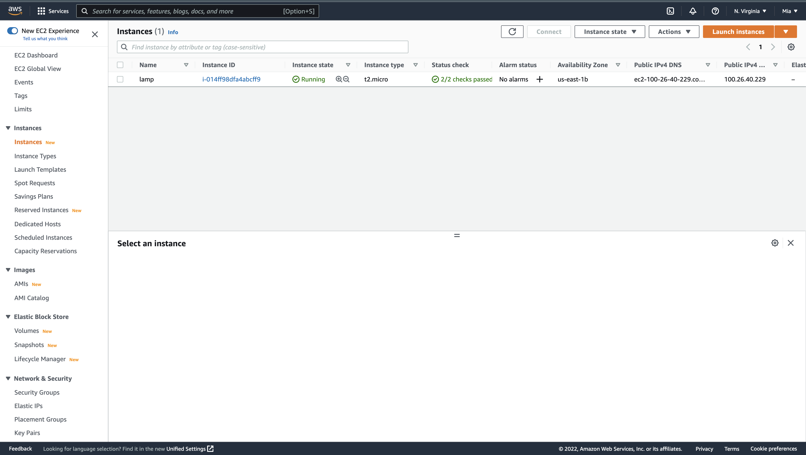
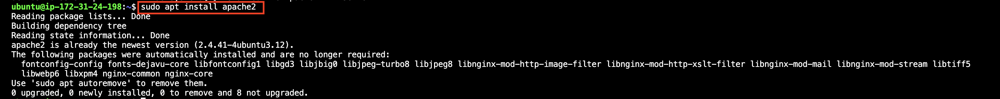
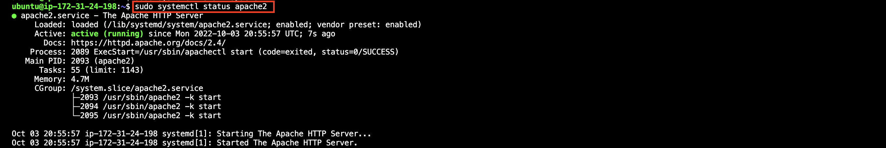
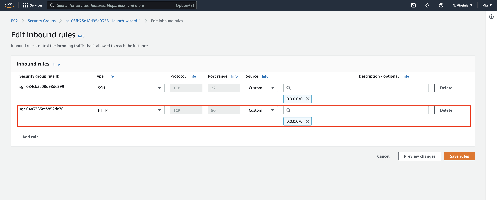
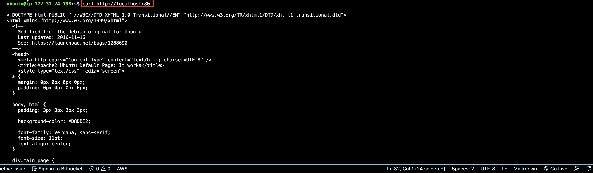
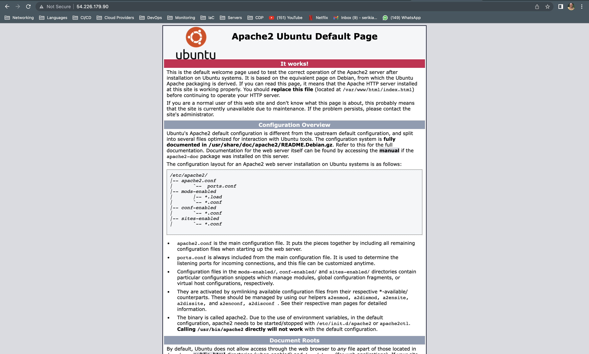
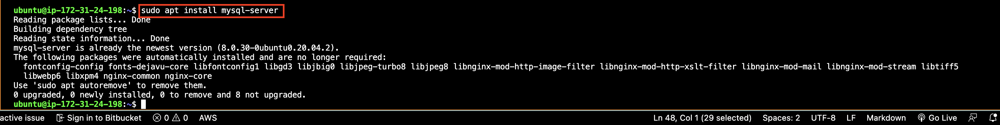
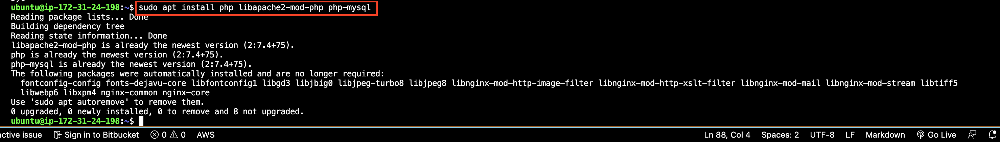

# LAMP STACK IMPLEMENTATION WITH AWS

## Prerequisites
Create an EC2 instance on AWS with the  following specification
> Instance ID : t2.micro
  Type : Ubuntu server 22.04 LTS (HVM)



## Step 1 - Installing The Apache Server
Apache server is a widely used web server and runs on 67% of all webservers in the world
1. Install Apache and confirm installation
```
#update a list of packages in package manager
sudo apt update

#run apache2 package installation
sudo apt install apache2

#verify the installation
sudo systemctl status apache2
```



2. Open port 80 so the webserver can receive traffic



3. Try to access the server locally 
```
curl http://localhost:80
or
curl http://127.0.0.1:80
```



4. Try to access the server from your browser
`http://<Public-IP-Address>:80`



## Step 2 - Installing MySQL
1. Use 'apt' to install the software
```
#install the sql server
sudo apt install mysql-server
```



2. Log into the console by running:
`sudo mysql`

you should see this output

```
Welcome to the MySQL monitor.  Commands end with ; or \g.
Your MySQL connection id is 11
Server version: 8.0.30-0ubuntu0.20.04.2 (Ubuntu)

Copyright (c) 2000, 2022, Oracle and/or its affiliates.

Oracle is a registered trademark of Oracle Corporation and/or its
affiliates. Other names may be trademarks of their respective
owners.

Type 'help;' or '\h' for help. Type '\c' to clear the current input statement.

mysql> 
```

The server is now installed and secure, you can exit the DB by typing  'exit'

## Step 3 - Installing PHP 
In addition to the php package, we’ll need php-mysql, a PHP module that allows PHP to communicate with MySQL-based databases. 
You’ll also need libapache2-mod-php to enable Apache to handle PHP files.
```
#install php
sudo apt install php 

#install libapache2-mod-php
sudo apt install libapache2-mod-php 

#install php-mysql
sudo apt install php-mysql
```



PHP components are installed.


## Step 4 - Creating A Virtual Host For Your Website Using Apache
To test the setup with a PHP script, set up a proper Apache Virtual Host to hold the website’s files and folders. 

1. Set up a domain called projectlamp
```
#Create the directory for projectlamp using ‘mkdir’
sudo mkdir /var/www/projectlamp

#give ownership of the directory to the system user
sudo chown -R $USER:$USER /var/www/projectlamp
```

2. Create and open a new configuration file in Apache’s sites-available directory
```
sudo vi /etc/apache2/sites-available/projectlamp.conf

#content of the file
<VirtualHost *:80>
    ServerName projectlamp
    ServerAlias www.projectlamp 
    ServerAdmin webmaster@localhost
    DocumentRoot /var/www/projectlamp
    ErrorLog ${APACHE_LOG_DIR}/error.log
    CustomLog ${APACHE_LOG_DIR}/access.log combined
</VirtualHost>
```
We’re telling Apache to serve projectlamp using /var/www/projectlamp as its web root directory

3. Enable the new virtual host
`sudo a2ensite projectlamp`

4. Test that the virtual host works as expected
```
# Put this conte t in the web root  /var/www/projectlamp
sudo echo 'Hello LAMP from hostname' $(curl -s http://169.254.169.254/latest/meta-data/public-hostname) 'with public IP' $(curl -s http://169.254.169.254/latest/meta-data/public-ipv4) > /var/www/projectlamp/index.html
```

5. Access the web url through a browser
`http://<Public-IP-Address>:80`


The index.html file take precedence over index.php, so rename or remove the index.html file.

## Step 5 - Enabling PHP On The Website
1. Create an index.php file inside the web root folder
```vim /var/www/projectlamp/index.php

#add the php code
<?php
phpinfo();
```
2. Refresh your browser
