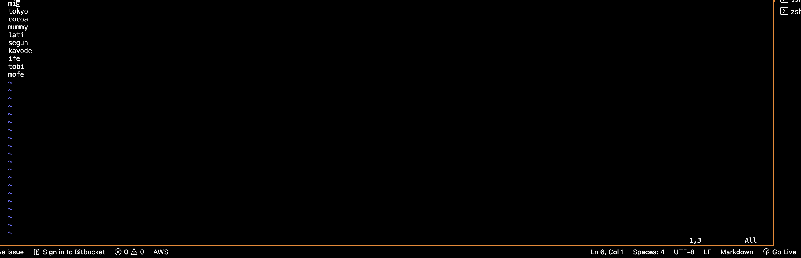
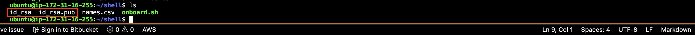
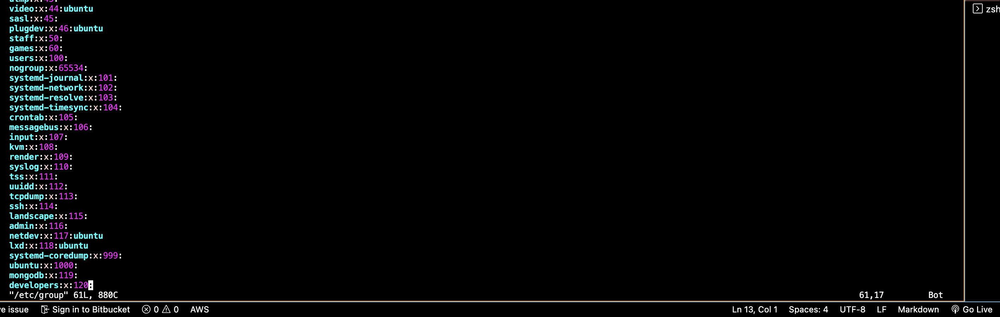
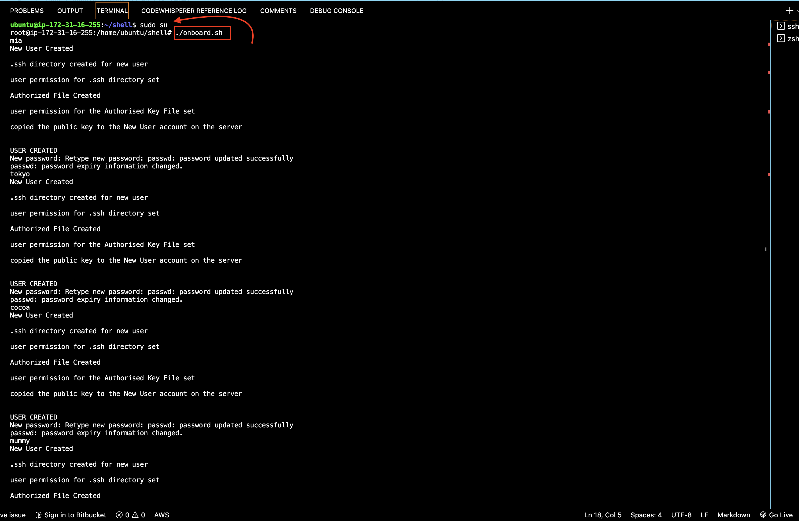
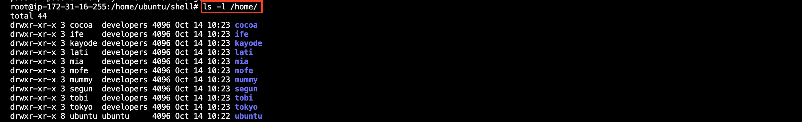
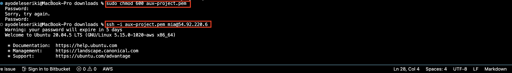

# SHELL SCRIPTING

1. First off i created the shell script, check out onboard.sh in this repository

2. Create a shell folder and a names.csv file in it

3. Create files for the public and private keys

4. create the devloper group
`sudo groupadd developers`

5. Make the file executable
`sudo chmod +x onboard.sh`

6. Run the file as an admin

7. Confirm they are created in the home directory
`ls -l /home/`

8. User Mia attempting to log into the server 
   - create a private key file. this private key will recognize the public key on the server you're trying to log into and authorize you as a developer.
   - give the file only neccessary permissions and ssh into the server 
   
