# WEB SOLUTION WITH WORDPRESS

1. Servers, one acts as the database and the other as the webserver
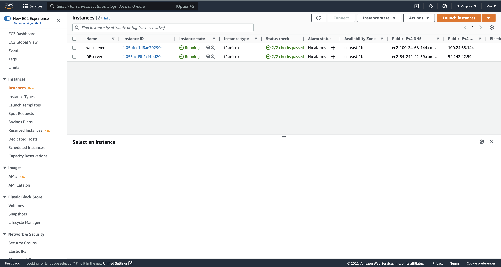

2. Create and attach 3 Vloumes for the webserver
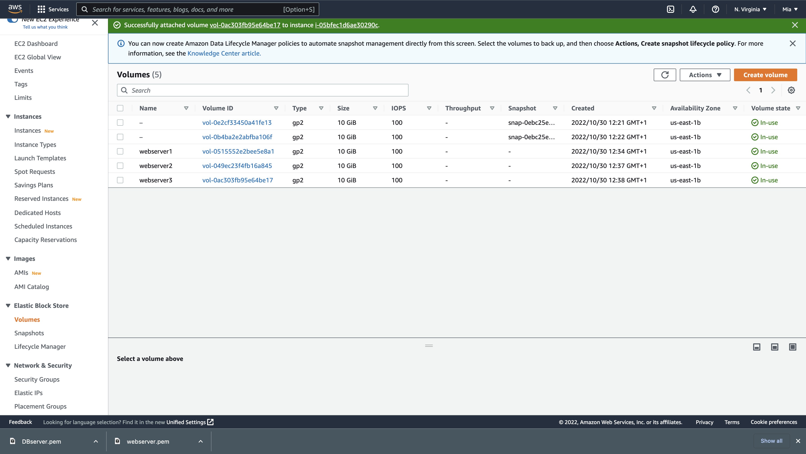

3. Use the `lsblk` command to see the volumes created
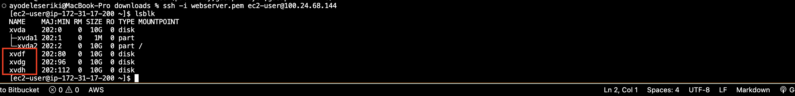

4.`df h` to see the free space in the server
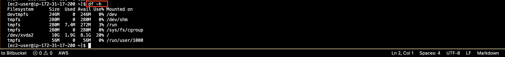

5. `gdisk` utility to craete single partitions on each disk
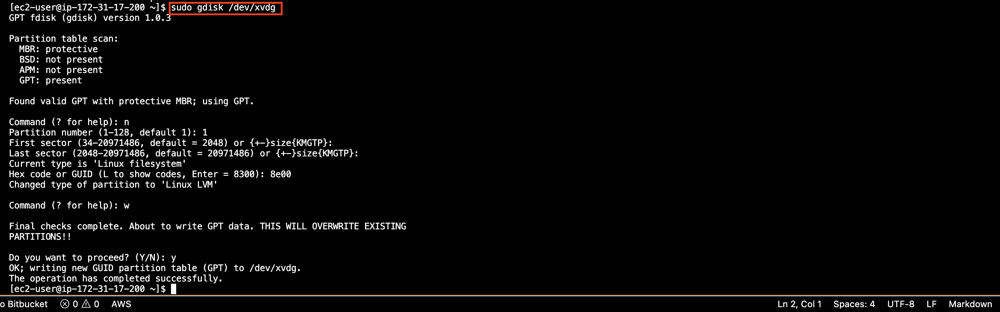

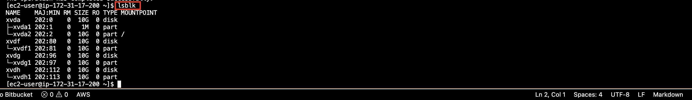

6. Install lvm2: LVM2 refers to the userspace toolset that provide logical volume management facilities on linux
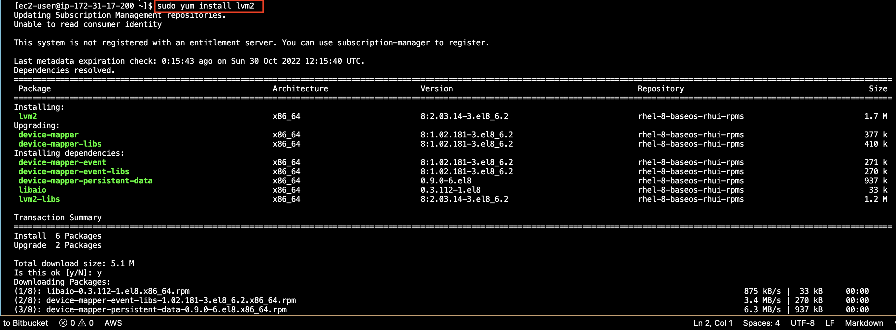

7. check for available partition
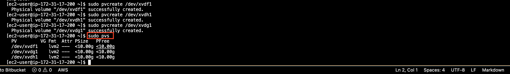

8. Volumes added to a group names webdata-vg
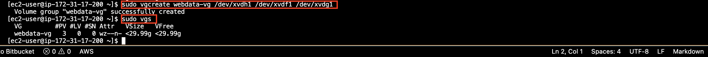

9. `lvcreate` to create logical volumes
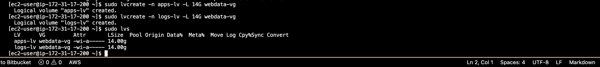

10. view the entire set up with
`sudo vgdisplay -v #view complete setup - VG, PV, and LV
sudo lsblk `
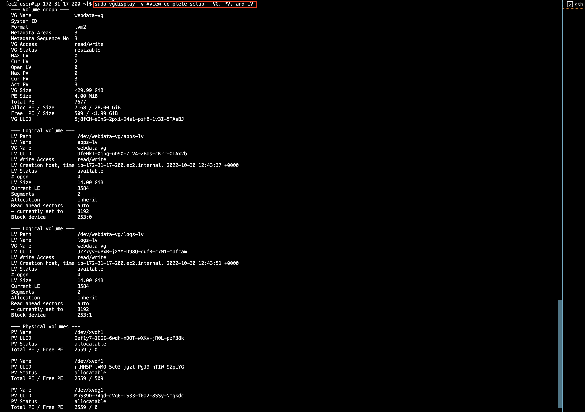

11. Formating the logical volumes with ext4 filesystem
`sudo mkfs -t ext4 /dev/webdata-vg/apps-lv
sudo mkfs -t ext4 /dev/webdata-vg/logs-lv`

12. Creating /var/www/html directory to store website files and /home/recovery/logs to store backup of log data
`sudo mkdir -p /var/www/html
sudo mkdir -p /home/recovery/logs`

13. Mounting /var/www/html on apps-lv logical volume
`sudo mount /dev/webdata-vg/apps-lv /var/www/html/`

14. Using rsync utility to backup all the files in the log directory /var/log into /home/recovery/logs
`sudo rsync -av /var/log/. /home/recovery/logs/`

15. Mounting /var/log on logs-lv logical volume. (Note that all the existing data on /var/log will be deleted.
`sudo mount /dev/webdata-vg/logs-lv /var/log`

===============
Updating /etc/fstab file so that the mount configuration will persist after restart of the server.