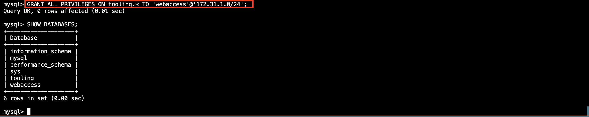
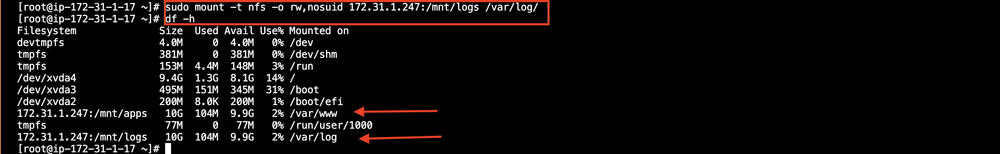

# DEVOPS TOOLING WEBSITE SOLUTION

## Summary
Implement a tooling website solution which makes access to DevOps tools within the corporate infrastructure easily accessible.

## Step 1 – Prepare NFS Server

**1.** Using an EC2 instance with RHEL Linux 8 Operating System


**2.** Configuring LVM on the server

**3.** Install NFS server on the instance 

```
sudo yum -y update
sudo yum install nfs-utils -y
sudo systemctl start nfs-server.service
sudo systemctl enable nfs-server.service
sudo systemctl status nfs-server.service
```


**4.** Set permissions to allow to web servers, read, write and execute files on NFS

```
sudo chown -R nobody: /mnt/apps
sudo chown -R nobody: /mnt/logs
sudo chown -R nobody: /mnt/opt

sudo chmod -R 777 /mnt/apps
sudo chmod -R 777 /mnt/logs
sudo chmod -R 777 /mnt/opt

sudo systemctl restart nfs-server.service
```

**5.** Configure access to NFS for clients within the same subnet (example of Subnet CIDR – 172.31.32.0/20 ):


```
sudo vi /etc/exports

/mnt/apps <Subnet-CIDR>(rw,sync,no_all_squash,no_root_squash)
/mnt/logs <Subnet-CIDR>(rw,sync,no_all_squash,no_root_squash)
/mnt/opt <Subnet-CIDR>(rw,sync,no_all_squash,no_root_squash)
```

`sudo exportfs -arv`


**6.** Open the port being used by NFS


**7.** Also, Open ports  TCP 111, UDP 111, UDP 2049 to make NFS server to be accessible from the client server


## Step 2 — Congigure The Database Server

**1.** Install the DB server, create a database called tooling and a database user called webaccess

**2.** Grant permission to webaccess user on tooling database to do anything only from the webservers subnet cidr



## Step 3 — Prepare the Web Servers

**1.** A new EC2 instance which will act as the client 


**2.** Install NFS client

`sudo yum install nfs-utils nfs4-acl-tools -y`


**3.** Mount /var/www/ and target the NFS server’s export for apps

```
sudo mkdir /var/www
sudo mount -t nfs -o rw,nosuid <NFS-Server-Private-IP-Address>:/mnt/apps /var/www
```


**4.** Persist the change by adding the fllowing line in the `/etc/fstab` file

`<NFS-Server-Private-IP-Address>:/mnt/apps /var/www nfs defaults 0 0`


**5.** Install Apache and PHP

```
sudo yum install httpd -y

sudo dnf install https://dl.fedoraproject.org/pub/epel/epel-release-latest-8.noarch.rpm

sudo dnf install dnf-utils http://rpms.remirepo.net/enterprise/remi-release-8.rpm

sudo dnf module reset php

sudo dnf module enable php:remi-7.4

sudo dnf install php php-opcache php-gd php-curl php-mysqlnd

sudo systemctl start php-fpm

sudo systemctl enable php-fpm

setsebool -P httpd_execmem 1
```

```
[ec2-user@ip-172-31-1-111 ~]$ systemctl status php-fpm.service
● php-fpm.service - The PHP FastCGI Process Manager
     Loaded: loaded (/usr/lib/systemd/system/php-fpm.service; enabled; vendor preset: disabled)
     Active: active (running) since Wed 2023-01-04 08:39:35 UTC; 1min 35s ago
   Main PID: 14439 (php-fpm)
     Status: "Processes active: 0, idle: 5, Requests: 0, slow: 0, Traffic: 0req/sec"
      Tasks: 6 (limit: 4384)
     Memory: 12.6M
        CPU: 57ms
     CGroup: /system.slice/php-fpm.service
             ├─14439 "php-fpm: master process (/etc/php-fpm.conf)"
             ├─14440 "php-fpm: pool www"
             ├─14441 "php-fpm: pool www"
             ├─14442 "php-fpm: pool www"
             ├─14443 "php-fpm: pool www"
             └─14444 "php-fpm: pool www"

Jan 04 08:39:35 ip-172-31-1-111.ec2.internal systemd[1]: Starting The PHP FastCGI Process Manager...
Jan 04 08:39:35 ip-172-31-1-111.ec2.internal systemd[1]: Started The PHP FastCGI Process Manager.
```


**6.** To confirm that NFS has been mounted properly, the files and directories on the webserver  /var/www should also be on the NFS server /mnt/apps


**7.** Locate the log folder for Apache on the Web Server and mount it to NFS server’s export for logs, persist the change.




mysql -h 172.31.1.191 -u webaccess -p password < tooling-db.sql
mysql -h 172.31.1.191 -u 'webaccess'@'172.31.1.0/24' -p password < tooling-db.sql

INSERT INTO users(‘id’, ‘username’, ‘password’, ’email’, ‘user_type’, ‘status’) VALUES(1, ‘myuser’, ‘5f4dcc3b5aa765d61d8327deb882cf99’, ‘user@mail.com’, ‘admin’, ‘1’);

problem 1: SET PASSWORD FOR 'webaccess'@'172.31.1.0/24' = 'password';

http://44.202.52.192/index.php 


