# MERN STACK IMPLEMENTATION

Deploy a Simple To-DO application that creates To-Do lists

## Prerequisites
Create an EC2 instance on AWS with the  following specification
> Instance ID : t2.micro
  Type : Ubuntu server 22.04 LTS (HVM)

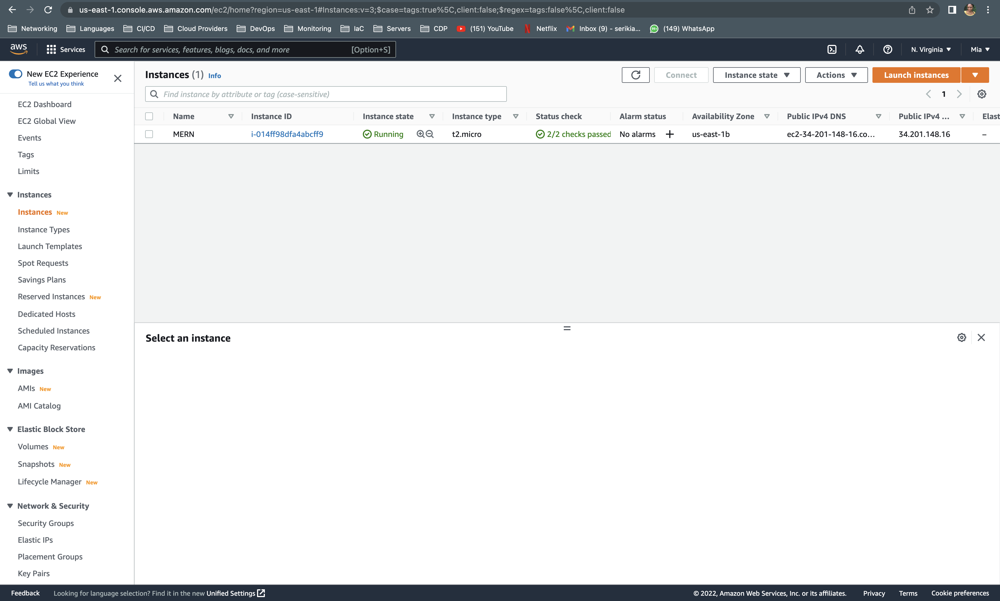

## Configuring The Backend
```
#update ubuntu
sudo apt update

#Upgrade ubuntu
sudo apt upgrade
```

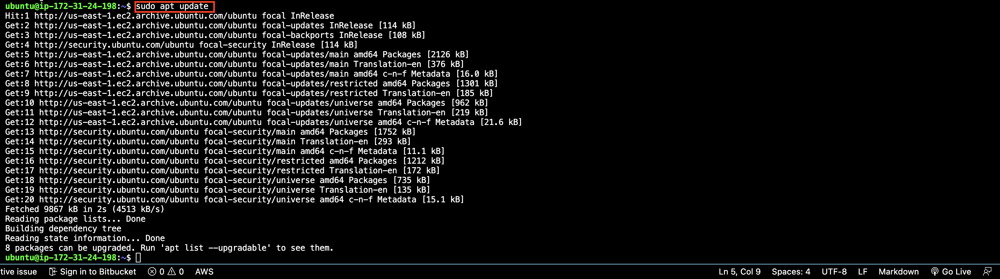
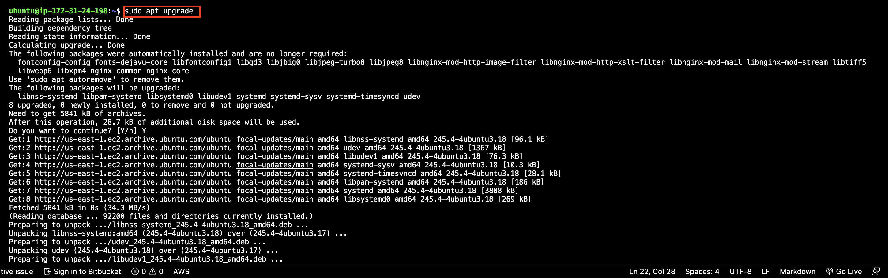

1. Install node.js on the server 
`sudo apt-get install -y nodejs`

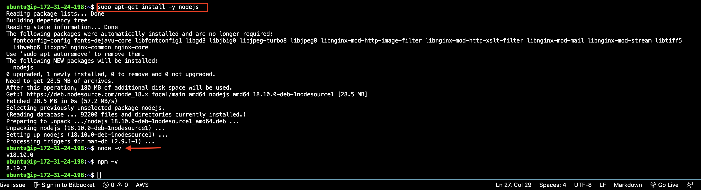

## Aplication Code Setup
```
#create the directory
mkdir Todo

#verify the directory is created
ls

#change directory
cd Todo

#initialise project
npm init
```
A new file named package.json will be created. This file will normally contain information about your application and the dependencies that it needs to run.
Follow the prompts after running the command. You can press Enter several times to accept default values, then accept to write out the package.json file by typing yes.

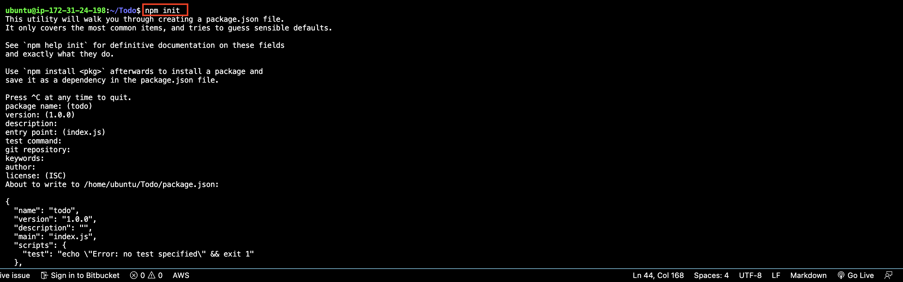

## Installing ExpressJS
1. Express is a framework for Node.js
```
#install express
npm install express

#install the dotenv module
npm install dotenv
```
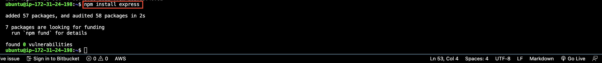

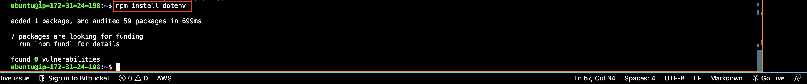

3. create na index.js file and add the contents in it 
```
#create the file
touch index.js

#open the file
vim index.js
```

#contents
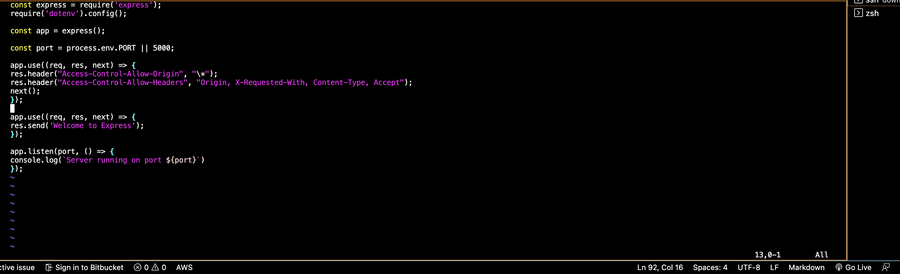

4. Start the server to see if it works
`node index.js`
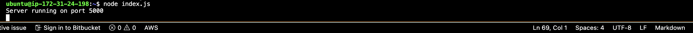

5. Open port 5000 in the EC2 security group on AWS
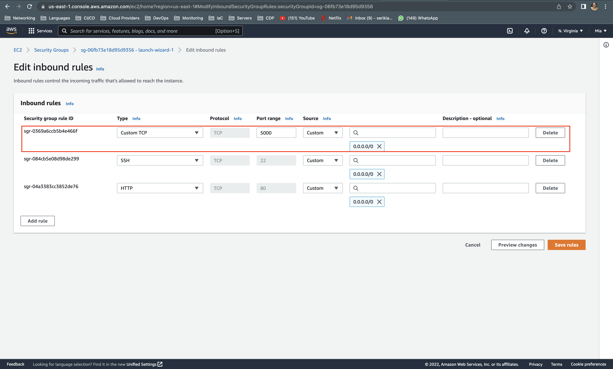

6. Try to access on browser
`http://<public-ip-address>:5000

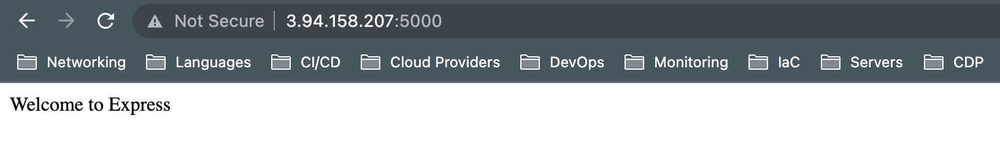

## Routing
For every task the To-Do app performs, there has to be an endpoint associated with the task(making use of HTTP request methods).
1.Create a routes directory and a file containing the code as shown.
```
#create directory
mkdir routes

#go into it
cd routes

#create file
touch api.js

#open file
vim api.js
```
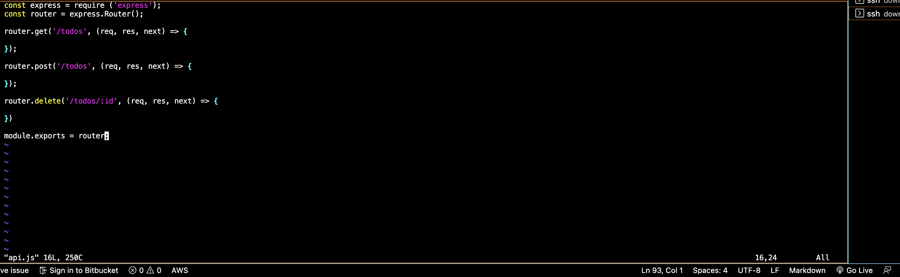

## Models
Models are what make the JavaScript applications interactive
A schema is a blueprint of how the database will be construtced
To create a schema, we'll have to install mongose which is a Node.js package

```
#To install mongose, create the models directory and create a file in the directory
mkdir models && cd models && touch todo.js
```
In the todo.js file
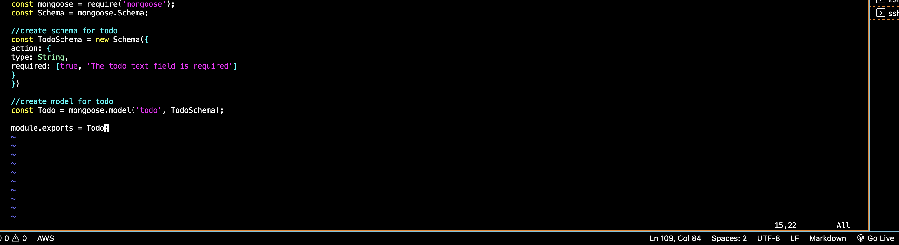

In the api.js file
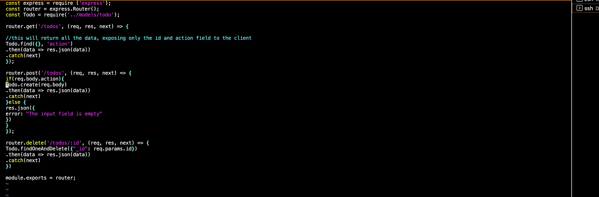

## Setting Up MongoDB 
