# WEB SOLUTION WITH WORDPRESS

1. Servers, one acts as the database and the other as the webserver
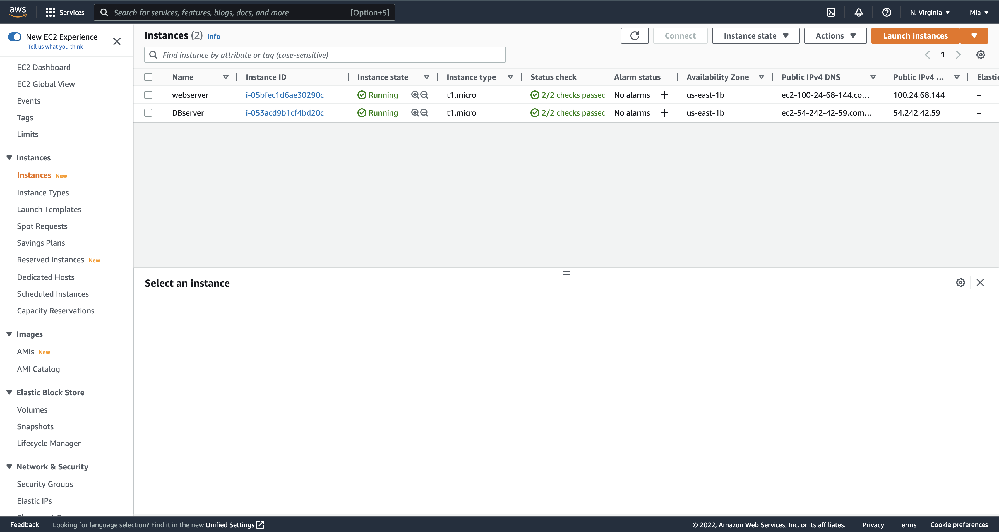

2. Create and attach 3 Vloumes for the webserver
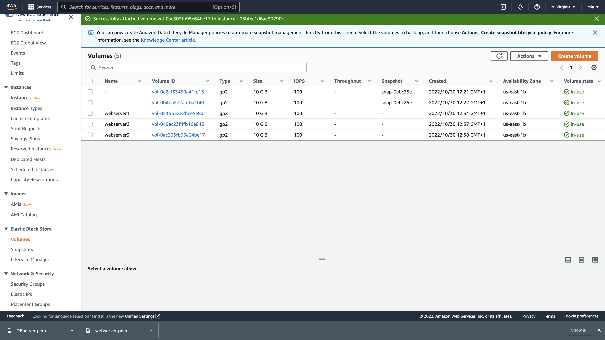

3. Use the `lsblk` command to see the volumes created
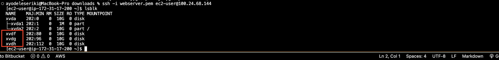

4.`df h` to see the free space in the server
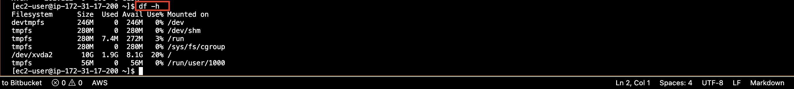

5. `gdisk` utility to craete single partitions on each disk
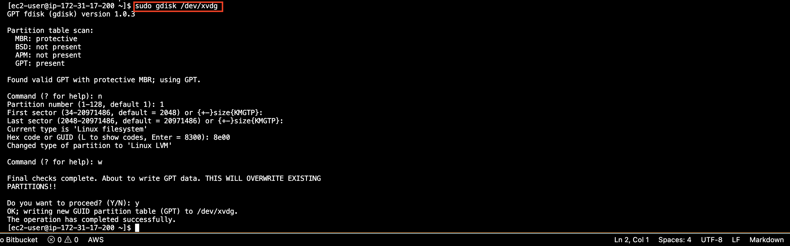

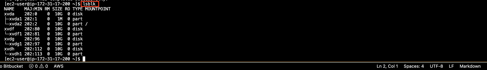

6. Install lvm2: LVM2 refers to the userspace toolset that provide logical volume management facilities on linux
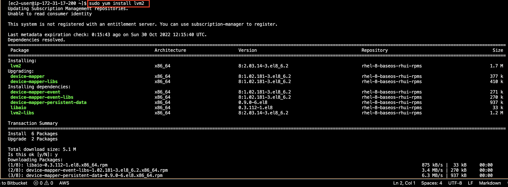

7. check for available partition
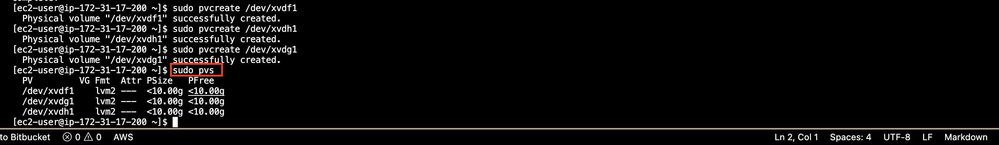

8. Volumes added to a group names webdata-vg
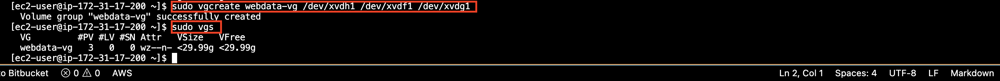

9. `lvcreate` to create logical volumes
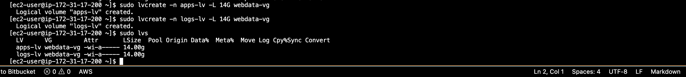

10. view the entire set up with
`sudo vgdisplay -v #view complete setup - VG, PV, and LV
sudo lsblk `
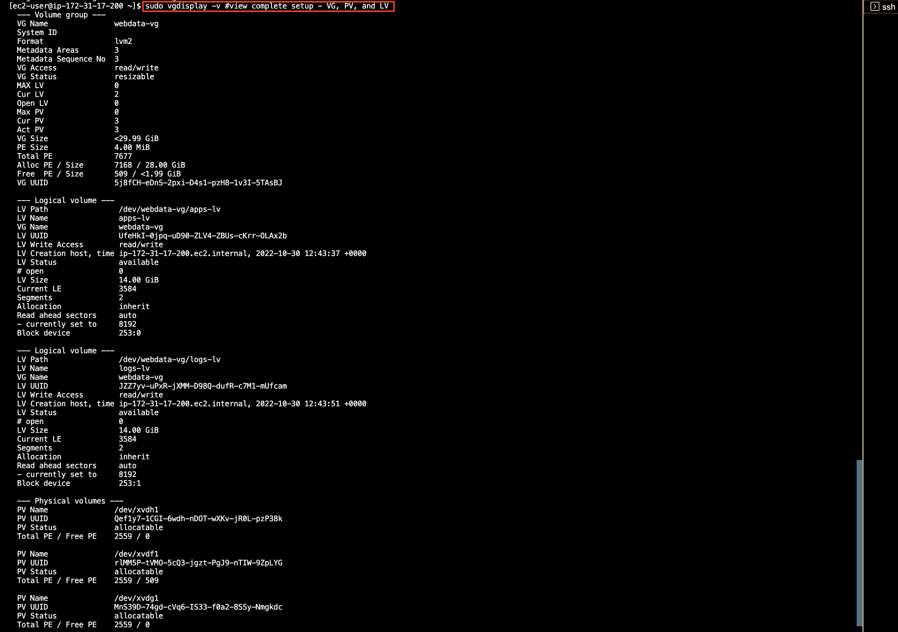

11. 

 
 