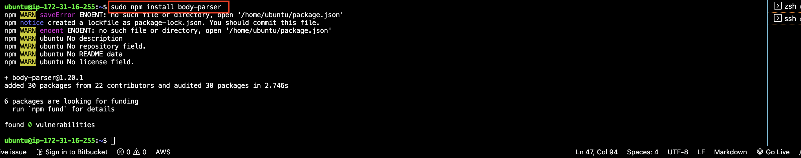
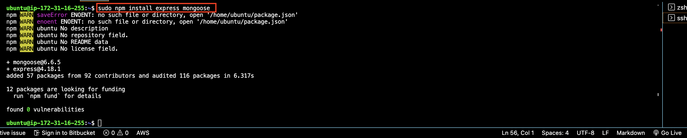

# MEAN STACK IMPLEMENTATION

Implenet a book register web from using the mean stack

## Prerequisites
Create an EC2 instance on AWS with the  following specification
> Instance ID : t2.micro
  Type : Ubuntu server 22.04 LTS (HVM)

## Install Node.js
```
#update ubuntu
sudo apt update

#upgrade ubuntu
sudo apt upgrade
```
```
#add certificates
sudo apt -y install curl dirmngr apt-transport-https lsb-release ca-certificates

curl -sL https://deb.nodesource.com/setup_12.x | sudo -E bash -
```


```
#install NodeJS
sudo apt install -y nodejs
```

## Install Mongodb
1. install mongodb
`sudo apt install -y mongodb`

2. start the server 
```
#start
sudo service mongodb start

#confirm
sudo systemctl status mongodb
```
3.
```
#Install npm – Node package manager
sudo apt install -y npm

#Install body-parser package
#We need ‘body-parser’ package to help us process JSON files passed in requests to the server.
sudo npm install body-parser
```



## Install express and set up routes to the server


## Access the routes with Angular.JS