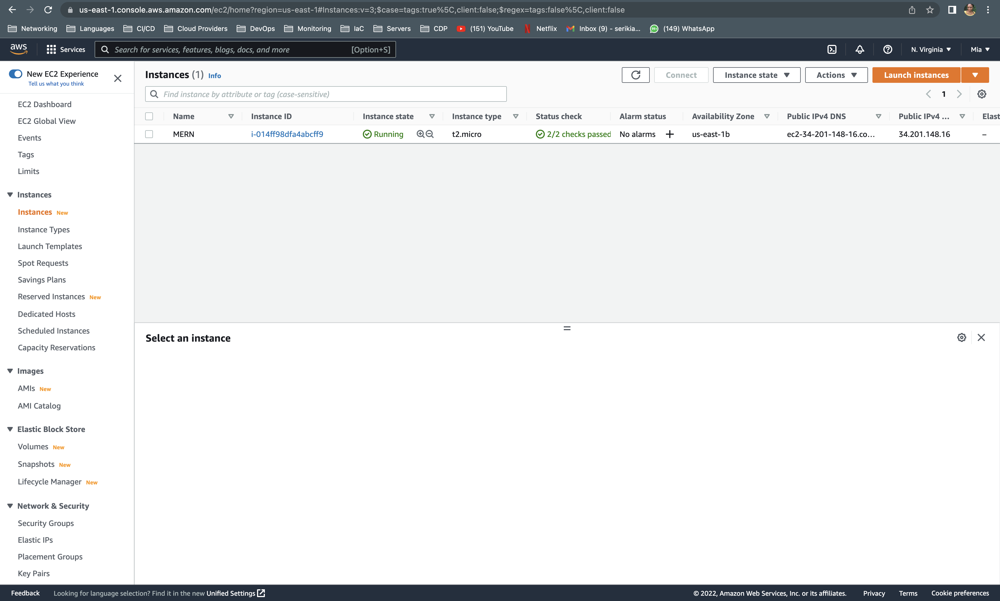
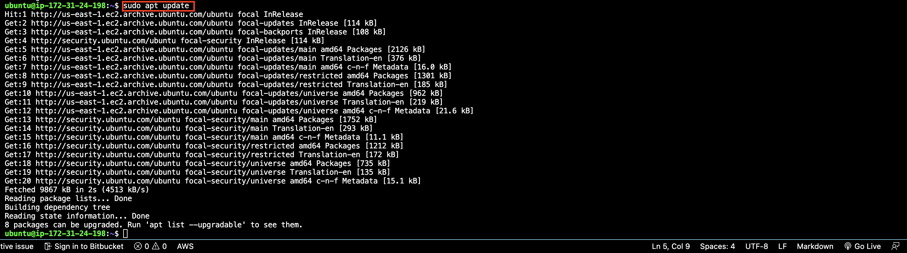
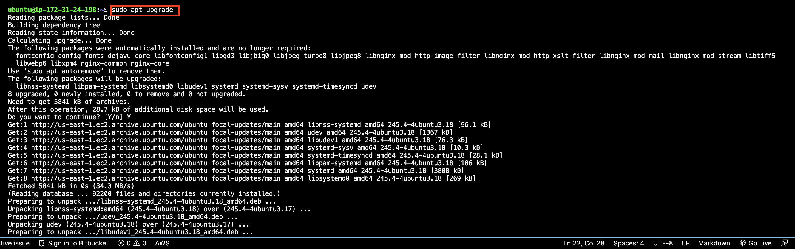
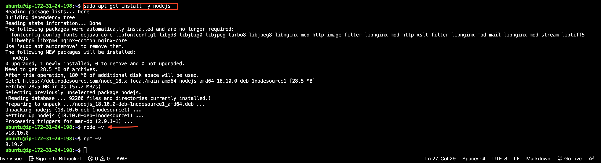
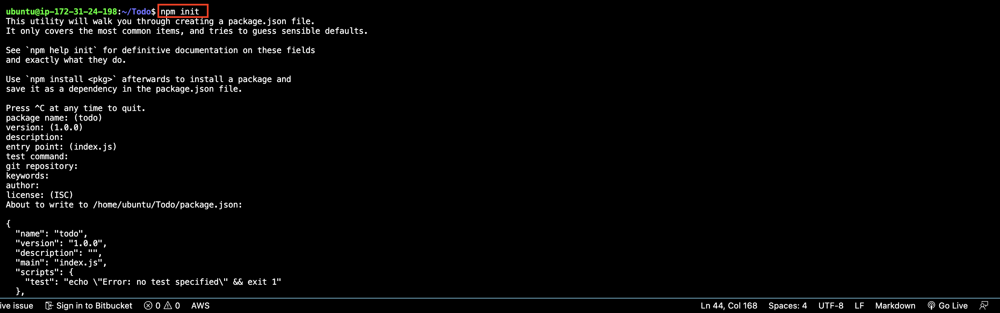

# MERN STACK IMPLEMENTATION

Deploy a Simple To-DO application that creates To-Do lists

## Prerequisites
Create an EC2 instance on AWS with the  following specification
> Instance ID : t2.micro
  Type : Ubuntu server 22.04 LTS (HVM)



## Configuring The Backend
```
#update ubuntu
sudo apt update

#Upgrade ubuntu
sudo apt upgrade
```




1. Install node.js on the server 
`sudo apt-get install -y nodejs`



## Aplication Code Setup
```
#create the directory
mkdir Todo

#verify the directory is created
ls

#change directory
cd Todo

#initialise project
npm init
```
A new file named package.json will be created. This file will normally contain information about your application and the dependencies that it needs to run.
Follow the prompts after running the command. You can press Enter several times to accept default values, then accept to write out the package.json file by typing yes.



## Installing ExpressJS